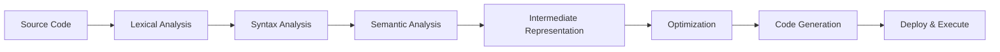
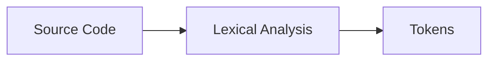
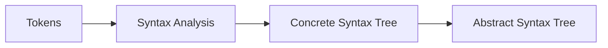
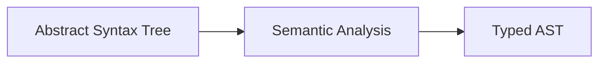
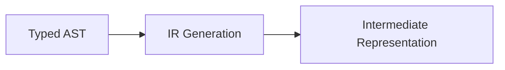
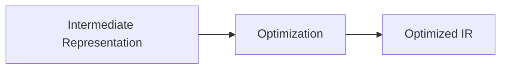
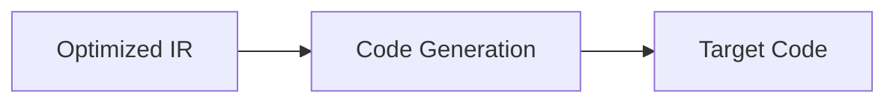
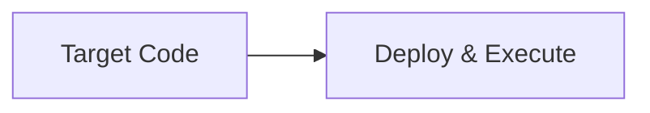

# Overview of Sway Compiler

Sway is a language developed for the Fuel blockchain. It is heavily inspired by Rust and aims to bring modern language development and performance to the blockchain ecosystem.

## Compilation Process Overview

The compilation process for Sway can be broken down into several key steps:



1. Lexical Analysis (Lexer):
The source code is broken down into tokens, identifying keywords, identifiers, literals, and operators.

2. Syntax Analysis (Parser):
The tokens are analyzed to ensure they conform to the language's syntax rules, forming an Abstract Syntax Tree (AST).

3. Semantic Analysis:
The AST is checked for semantic correctness, including type checking and scoping rules.

4. Intermediate Representation (IR) Generation:
The validated AST is translated into an intermediate representation (IR) for easier manipulation.

5. Optimization:
Optional step to optimize the IR for better performance or reduced size.

6. Code Generation:
The optimized IR is translated into target code, suitable for execution on the blockchain platform.

7. Deployment and Execution:

The generated code is deployed as a smart contract on the blockchain and executed when triggered.

Let's go deeper into each step of the compilation process.

---

## Lexical Analysis (Lexer)



The Lexical Analysis phase, also known as lexing, involves breaking the source code into tokens.
These tokens represent the smallest units of the programming language, such as keywords, identifiers, literals, and operators.

This process starts in [`lex (sway-parse/src/token.rs)`](https://github.com/FuelLabs/sway/blob/6c21a39bea6807b30e5c0ffc4aa5b8db5a0b675b/sway-parse/src/token.rs#L98):

```rust
pub fn lex(
    handler: &Handler,
    src: &Arc<str>,
    start: usize,
    end: usize,
    source_id: Option<SourceId>,
) -> Result<TokenStream> {
```

It returns a [`TokenStream (sway-ast/src/token.rs)`](https://github.com/FuelLabs/sway/blob/6c21a39bea6807b30e5c0ffc4aa5b8db5a0b675b/sway-ast/src/token.rs#L206), which consists of stream of a tree of tokens.

```rust
pub enum GenericTokenTree<T> {
    Punct(Punct),
    Ident(Ident),
    Group(GenericGroup<T>),
    Literal(Literal),
    DocComment(DocComment),
}
```

---

## Syntax Analysis (Parser)



In the Syntax Analysis phase, the tokens generated by the lexer are analyzed to ensure they follow the grammar rules of the language.

This process is done in two steps:

1. The parser initially produces a Concrete Syntax Tree (CST)
2. The Concrete Syntax Tree is then processed into an Abstract Syntax Tree (AST)

The implementation starts in [`parse (sway-core/src/lib.rs)`](https://github.com/FuelLabs/sway/blob/6c21a39bea6807b30e5c0ffc4aa5b8db5a0b675b/sway-core/src/lib.rs#L87C1-L92C2), which returns both the `CST` and `AST`, represented by the `LexedProgram` and `ParseProgram` types.

```rust
pub fn parse(
    input: Arc<str>,
    handler: &Handler,
    engines: &Engines,
    config: Option<&BuildConfig>,
) -> Result<(lexed::LexedProgram, parsed::ParseProgram), ErrorEmitted>
```

---

## Syntax Analysis (Concrete Syntax Tree)

The CST is implemented by the [`LexedProgram` (sway-core/src/language/lexed/mod.rs)](https://github.com/FuelLabs/sway/blob/89e5708402108fa383b6f7a7351f5ae5f357bbe1/sway-core/src/language/lexed/mod.rs#L11) type and represents a tree of source code modules: the root module as well as all the submodules introduced by the source with the `mod` keyword.

```rust
/// A module and its submodules in the form of a tree.
pub struct LexedProgram {
    pub kind: TreeType,
    pub root: LexedModule,
}

pub struct LexedModule {
    /// The content of this module in the form of a [Module].
    pub tree: Module,
    /// Submodules introduced within this module using the `mod` syntax in order of declaration.
    pub submodules: Vec<(ModName, LexedSubmodule)>,
}

/// A library module that was declared as a `mod` of another module.
pub struct LexedSubmodule {
    pub module: LexedModule,
}
```

Each [`Module` (sway-ast/src/module.rs)](https://github.com/FuelLabs/sway/blob/89e5708402108fa383b6f7a7351f5ae5f357bbe1/sway-ast/src/module.rs#L4) contains a list of its contained syntax items:

```rust
pub struct Module {
    pub kind: ModuleKind,
    pub items: Vec<Item>,
    ...
}
```

Each item represents a specific item in the language syntax, represented by `Item` and [`ItemKind (sway-ast/src/item/mod.rs)`](https://github.com/FuelLabs/sway/blob/6c21a39bea6807b30e5c0ffc4aa5b8db5a0b675b/sway-ast/src/item/mod.rs#L30C2-L45C2):

```rust
pub enum ItemKind {
    Submodule(Submodule),
    Use(ItemUse),
    Struct(ItemStruct),
    Enum(ItemEnum),
    Fn(ItemFn),
    Trait(ItemTrait),
    Impl(ItemImpl),
    Abi(ItemAbi),
    Const(ItemConst),
    Storage(ItemStorage),
    Configurable(ItemConfigurable),
    TypeAlias(ItemTypeAlias),
    ...
}
```

---

## Syntax Analysis (Abstract Syntax Tree)

The AST is produced from the CST and is a more structured representation that is more convenient for further manipulation, this is done in [`convert_parse_tree`](https://github.com/FuelLabs/sway/blob/89e5708402108fa383b6f7a7351f5ae5f357bbe1/sway-core/src/transform/to_parsed_lang/convert_parse_tree.rs#L48), [`module_to_sway_parse_tree`](https://github.com/FuelLabs/sway/blob/89e5708402108fa383b6f7a7351f5ae5f357bbe1/sway-core/src/transform/to_parsed_lang/convert_parse_tree.rs#L70) and [`item_to_ast_nodes` (sway-core/src/transform/to_parsed_lang/convert_parse_tree.rs)](https://github.com/FuelLabs/sway/blob/89e5708402108fa383b6f7a7351f5ae5f357bbe1/sway-core/src/transform/to_parsed_lang/convert_parse_tree.rs#L108C8-L108C25).

The AST is implemented by the [`ParseProgram`](https://github.com/FuelLabs/sway/blob/89e5708402108fa383b6f7a7351f5ae5f357bbe1/sway-core/src/language/parsed/program.rs#L11), which consists a tree of modules ([`ParseModule` (sway-core/src/language/parsed/module.rs)](https://github.com/FuelLabs/sway/blob/89e5708402108fa383b6f7a7351f5ae5f357bbe1/sway-core/src/language/parsed/module.rs#L14)), each consisting of an hierarchical node-based representation for the language structure ([`AstNode`](https://github.com/FuelLabs/sway/blob/89e5708/sway-core/src/language/parsed/mod.rs#L35) and [`AstNodeContent` (sway-core/src/language/parsed/mod.rs)](https://github.com/FuelLabs/sway/blob/89e5708/sway-core/src/language/parsed/mod.rs#L46)).

```rust
/// A parsed, but not yet type-checked, Sway program.
pub struct ParseProgram {
    pub kind: TreeType,
    pub root: ParseModule,
}

/// A module and its submodules in the form of a tree.
pub struct ParseModule {
    /// The content of this module.
    pub tree: ParseTree,
    /// Submodules introduced within this module.
    pub submodules: Vec<(ModName, ParseSubmodule)>,
    ...
```

```rust
/// Represents the various structures that constitute a Sway program.
pub enum AstNodeContent {
    /// A statement of the form `use foo::bar;` or `use ::foo::bar;`
    UseStatement(UseStatement),
    /// Any type of declaration, of which there are quite a few. See [Declaration] for more details
    /// on the possible variants.
    Declaration(Declaration),
    /// Any type of expression, of which there are quite a few. See [Expression] for more details.
    Expression(Expression),
    /// A statement of the form `mod foo::bar;` which imports/includes another source file.
    IncludeStatement(IncludeStatement),
    ...
}
```

The AST can be output in a text-based format by passing the `--ast` option to `forc build`.

---

## Semantic Analysis



Semantic Analysis verifies the meaning of the code by checking for semantic errors, such as type mismatches and undeclared variables.
It produces a typed AST that ensures the code's correctness according to the language's semantics.

The entire process starts in [`parsed_to_ast` (sway-core/src/lib.rs)](https://github.com/FuelLabs/sway/blob/6c21a39bea6807b30e5c0ffc4aa5b8db5a0b675b/sway-core/src/lib.rs#L520), and returns a fully-typed AST, [`ty::TyProgram` (sway-core/src/language/ty/program.rs)](https://github.com/FuelLabs/sway/blob/6c21a39bea6807b30e5c0ffc4aa5b8db5a0b675b/sway-core/src/language/ty/program.rs#L20):

```rust
pub fn parsed_to_ast(
    handler: &Handler,
    engines: &Engines,
    parse_program: &mut parsed::ParseProgram,
    initial_namespace: namespace::Root,
    build_config: Option<&BuildConfig>,
    package_name: &str,
    retrigger_compilation: Option<Arc<AtomicBool>>,
) -> Result<ty::TyProgram, ErrorEmitted>
```

Inside it we run a few different steps, let's go through them.

---

## Semantic Analysis (Module Dependency Graph)

We start by building a module dependency graph for the source code modules, this is done in [`ty::TyModule::build_dep_graph` (sway-core/src/semantic_analysis/module.rs)](https://github.com/FuelLabs/sway/blob/6c21a39bea6807b30e5c0ffc4aa5b8db5a0b675b/sway-core/src/semantic_analysis/module.rs#L192)

```rust
impl ty::TyModule {
    /// Analyzes the given parsed module to produce a dependency graph.
    pub fn build_dep_graph(
        handler: &Handler,
        parsed: &ParseModule,
    ) -> Result<ModuleDepGraph, ErrorEmitted>
}
```

The graph has the different modules as nodes and their dependencies as edges,
and allows us to compute the correct module evaluation order by running a topological sort.

The module evaluation order is then used when evaluating the next passes on the AST.

---

## Semantic Analysis (Symbol Collection)

We proceed by collecting the symbols present in the AST, in [`ty::TyAstNode::collect` (sway-core/src/semantic_analysis/ast_node/mod.rs)](https://github.com/FuelLabs/sway/blob/6c21a39bea6807b30e5c0ffc4aa5b8db5a0b675b/sway-core/src/semantic_analysis/ast_node/mod.rs#L25)

```rust
impl ty::TyAstNode {
    pub(crate) fn collect(
        handler: &Handler,
        engines: &Engines,
        ctx: &mut SymbolCollectionContext,
        node: &AstNode,
    ) -> Result<(), ErrorEmitted>
}
```

The result of this is a tree of namespaces, which contains all the necessary information we need to resolve string-based identifiers into a link to the corresponding declaration.

---

## Semantic Analysis (Namespaces)

Each [`Namespace`](https://github.com/FuelLabs/sway/blob/6c21a39/sway-core/src/semantic_analysis/namespace/namespace.rs#L27) corresponds to a module, and contains a tree of lexical scopes corresponding to the scopes in the source code.

Each [`LexicalScope`](https://github.com/FuelLabs/sway/blob/6c21a39/sway-core/src/semantic_analysis/namespace/lexical_scope.rs#L62) contains a symbol map, which maps from identifiers to a declaration.

```rust
pub struct Namespace {
    /// An immutable namespace that consists of the names that should always be present.
    init: Module,
    /// The `root` of the project namespace.
    pub(crate) root: Root,
    ...
}

pub struct Root {
    pub(crate) module: Module,
}

pub struct Module {
    /// Submodules of the current module represented as an ordered map.
    pub(crate) submodules: im::OrdMap<ModuleName, Module>,
    /// Keeps all lexical scopes associated with this module.
    pub lexical_scopes: Vec<LexicalScope>,
    ...
}

/// A `LexicalScope` contains a set of all items that exist within the lexical scope via declaration or
/// importing, along with all its associated hierarchical scopes.
pub struct LexicalScope {
    /// The set of symbols, implementations, synonyms and aliases present within this scope.
    pub items: Items,
    /// The set of available scopes defined inside this scope's hierarchy.
    pub children: Vec<LexicalScopeId>,
    /// The parent scope associated with this scope. Will be None for a root scope.
    pub parent: Option<LexicalScopeId>,
}

/// The set of items that exist within some lexical scope via declaration or importing.
pub struct Items {
    /// An ordered map from `Ident`s to their associated parsed declarations.
    pub(crate) parsed_symbols: ParsedSymbolMap,
    /// An ordered map from `Ident`s to their associated typed declarations.
    pub(crate) symbols: SymbolMap,
    ...
}
```

---

## Semantic Analysis (Type Checking)

In this step, we perform type checking, resolving the names with the previously built namespaces, and ensuring that the types used in a program are used consistently and correctly.

This process is done in [`ty::TyProgram::type_check` (sway-core/src/semantic_analysis/program.rs)](https://github.com/FuelLabs/sway/blob/6c21a39/sway-core/src/semantic_analysis/program.rs#L44).

We track the type checking inside the [`TypeCheckContext` (sway-core/src/semantic_analysis/type_check_context.rs)](https://github.com/FuelLabs/sway/blob/d90cbc8419e47283519e39046c3ea5616e64df84/sway-core/src/semantic_analysis/type_check_context.rs#L33)
context type.

```rust
impl TyProgram {
    pub fn type_check(
        handler: &Handler,
        engines: &Engines,
        parsed: &ParseProgram,
        initial_namespace: namespace::Root,
        package_name: &str,
        build_config: Option<&BuildConfig>,
    ) -> Result<Self, ErrorEmitted>
}
```

At this point we also perform monomorphization, a compiler technique to deal with generics,
where specialized code for each unique combination of generic types is generated, improving performance by avoiding runtime overhead.

This is done in [`TypeCheckContext::monomorphize<T> (sway-core/src/semantic_analysis/type_check_context.rs)`](https://github.com/FuelLabs/sway/blob/d90cbc8/sway-core/src/control_flow_analysis/analyze_return_paths.rs) and related [`TypeBinding (sway-core/src/type_system/ast_elements/binding.rs)`](https://github.com/FuelLabs/sway/blob/d90cbc8419e47283519e39046c3ea5616e64df84/sway-core/src/type_system/ast_elements/binding.rs#L160) types.

---

## Semantic Analysis (Control Flow Graph)

Now that we have a fully formed, typed AST, we can some further analysis on it.

For this we construct a control flow graph (CFG), which is a representation of the control
flow within a program, showing how control flows from one instruction to another.

It consists of nodes representing basic blocks of code and directed edges representing the flow of control between these blocks.

 CFGs are used in program analysis, and we use them to analyze return paths, ensuring
that all paths that are required to return a value do, indeed, return a value of the correct type.

It does this by checking every function declaration in both the methods namespace
and the functions namespace and validating that all paths leading to the function exit node
return the same type. Additionally, if a function has a return type, all paths must indeed
lead to the function exit node.

This is done in [`ControlFlowGraph (sway-core/src/control_flow_analysis/analyze_return_paths.rs)`](https://github.com/FuelLabs/sway/blob/d90cbc8/sway-core/src/control_flow_analysis/analyze_return_paths.rs).

---

## Semantic Analysis (Dead Code Analysis)

Dead code analysis is a process that identifies and eliminates portions of code that are never executed during program execution. It helps improve code quality, maintainability, and performance by removing redundant and unnecessary code. Dead code analysis is performed by compilers and static analysis tools, highlighting areas of code that serve no purpose and can be safely removed.

Here's how the Dead Code Analysis graph works:

Nodes: Nodes in the DCA graph represent different code segments or blocks within the program. These segments could be functions, loops, conditionals, or any other logical grouping of code.

Edges: Edges between nodes indicate control flow relationships between different code segments. For example, an edge might connect a conditional statement to the code blocks corresponding to its true and false branches.

Unreachable Code: The DCA graph identifies sections of code that are unreachable due to conditional statements, loop structures, or other control flow mechanisms. Unreachable code segments are disconnected from the main control flow of the program and typically represent dead code.

This is done in [`ControlFlowGraph::find_dead_code (sway-core/src/control_flow_analysis/dead_code_analysis.rs)`](https://github.com/FuelLabs/sway/blob/d90cbc8/sway-core/src/control_flow_analysis/dead_code_analysis.rs#L113).

The graph can be output in DOT format by passing the `--dca-graph` option to `forc build`.

---

## Intermediate Representation (IR) Generation



The Intermediate Representation Generation phase translates the validated, fully-typed AST into an intermediate representation (IR).

This IR serves as a bridge between the high-level code and the target code generation phase, making it easier to perform optimizations.

This process starts in [`compile_program (sway-core/src/ir_generation.rs)`](https://github.com/FuelLabs/sway/blob/6c21a39bea6807b30e5c0ffc4aa5b8db5a0b675b/sway-core/src/ir_generation.rs#L18C1-L23C48):

```rust
pub fn compile_program<'eng>(
    program: &ty::TyProgram,
    include_tests: bool,
    engines: &'eng Engines,
    experimental: ExperimentalFlags,
) -> Result<Context<'eng>, Vec<CompileError>>
```

And eventually outputs an IR file such as this one:

```rust
script {
    fn main() -> bool {
        entry():
        v0 = const u64 11
        v1 = const u64 0
        v2 = cmp eq v0 v1
        br block0()

        block0():
        v9 = const bool false
        ret bool v9
    }
}
```

The IR instructions can be output by passing the `--ir` option to `forc build`.

---

## Optimization



The Optimization phase is optional but highly beneficial. It applies various optimization techniques to the IR to improve the performance or reduce the size of the resulting code.

Common optimizations include constant folding, dead code elimination, and loop optimization.

The optimization passes are organized as different pass groups inside a [`PassManager (sway-ir/src/pass_manager.rs)`](https://github.com/FuelLabs/sway/blob/6c21a39bea6807b30e5c0ffc4aa5b8db5a0b675b/sway-ir/src/pass_manager.rs#L145), and setup in [`compile_ast_to_ir_to_asm (sway-core/src/lib.rs)`](https://github.com/FuelLabs/sway/blob/6c21a39bea6807b30e5c0ffc4aa5b8db5a0b675b/sway-core/src/lib.rs#L902):

```rust
        pass_group.append_pass(CONST_DEMOTION_NAME);
        pass_group.append_pass(ARG_DEMOTION_NAME);
        pass_group.append_pass(RET_DEMOTION_NAME);
        pass_group.append_pass(MISC_DEMOTION_NAME);

        // Convert loads and stores to mem_copies where possible.
        pass_group.append_pass(MEMCPYOPT_NAME);

        // Run a DCE and simplify-cfg to clean up any obsolete instructions.
        pass_group.append_pass(DCE_NAME);
        pass_group.append_pass(SIMPLIFY_CFG_NAME);

        match build_config.optimization_level {
            OptLevel::Opt1 => {
                pass_group.append_pass(SROA_NAME);
                pass_group.append_pass(MEM2REG_NAME);
                pass_group.append_pass(DCE_NAME);
            }
            OptLevel::Opt0 => {}
        }
```

This lets us provide different optimization levels. Then we [run the passes](https://github.com/FuelLabs/sway/blob/6c21a39bea6807b30e5c0ffc4aa5b8db5a0b675b/sway-core/src/lib.rs#L929) which returns optimized IR used by the next code generation step.

```rust
    // Run the passes.
    let res = if let Err(ir_error) = pass_mgr.run(&mut ir, &pass_group) {
```

---

## Code Generation



In the Code Generation phase, the optimized IR is translated into target code suitable for execution on the blockchain platform.

This code generation process ensures that the resulting bytecode or machine code adheres to the constraints and requirements of the target blockchain environment.

```rust
/// Given an AST compilation result, try compiling to a `CompiledAsm`,
/// containing the asm in opcode form (not raw bytes/bytecode).
pub fn ast_to_asm(
    handler: &Handler,
    engines: &Engines,
    programs: &Programs,
    build_config: &BuildConfig,
) -> Result<CompiledAsm, ErrorEmitted> {
```

The output of this step is Fuel VM assembly code, emitted by the [`FuelAsmBuilder (sway-core/src/asm_generation/fuel/fuel_asm_builder.rs)`](https://github.com/FuelLabs/sway/blob/d90cbc8/sway-core/src/asm_generation/fuel/fuel_asm_builder.rs#L33) type.

---

## Deployment and Execution



Finally, the generated code is deployed as a smart contract on the Fuel VM.
Smart contracts are executed when triggered by transactions or external events, and their behavior is governed by the code generated by the compiler.

---

## Engines

Our concurrent slabs are all contained inside [`Engines`](https://github.com/FuelLabs/sway/blob/6c21a39/sway-core/src/engine_threading.rs#L14C1-L20C2), which is the main type we use for passing around memory context in the compiler.

Inside it we have different engines for types, different kinds of declarations, query/cache systems and source code file ids.

You will see this type being passed everywhere around the compiler.

```rust
pub struct Engines {
    type_engine: TypeEngine,
    decl_engine: DeclEngine,
    parsed_decl_engine: ParsedDeclEngine,
    query_engine: QueryEngine,
    source_engine: SourceEngine,
}
```

---

## Concurrent Slab

We use the [memory arena pattern](https://en.wikipedia.org/wiki/Region-based_memory_management) in the compiler to manage the memory for our nodes.

Instead of having direct pointers/references to a node, we use integer-based ids, which are later used to index to a vector containing all the memory for a particular node kind.

This simplifies the memory
management of the compiler, allows safe concurrency, and also eases the representation of cyclic references in all our tree/graph based structures.

[`ConcurrentSlab`](https://github.com/FuelLabs/sway/blob/89e5708/sway-core/src/concurrent_slab.rs)

```rust
pub(crate) struct ConcurrentSlab<T> {
    pub inner: RwLock<Inner<T>>,
}

pub struct Inner<T> {
    pub items: Vec<Option<Arc<T>>>,
    pub free_list: Vec<usize>,
}
```

Related reading: [https://rust-leipzig.github.io/architecture/2016/12/20/idiomatic-trees-in-rust/](https://rust-leipzig.github.io/architecture/2016/12/20/idiomatic-trees-in-rust/)
